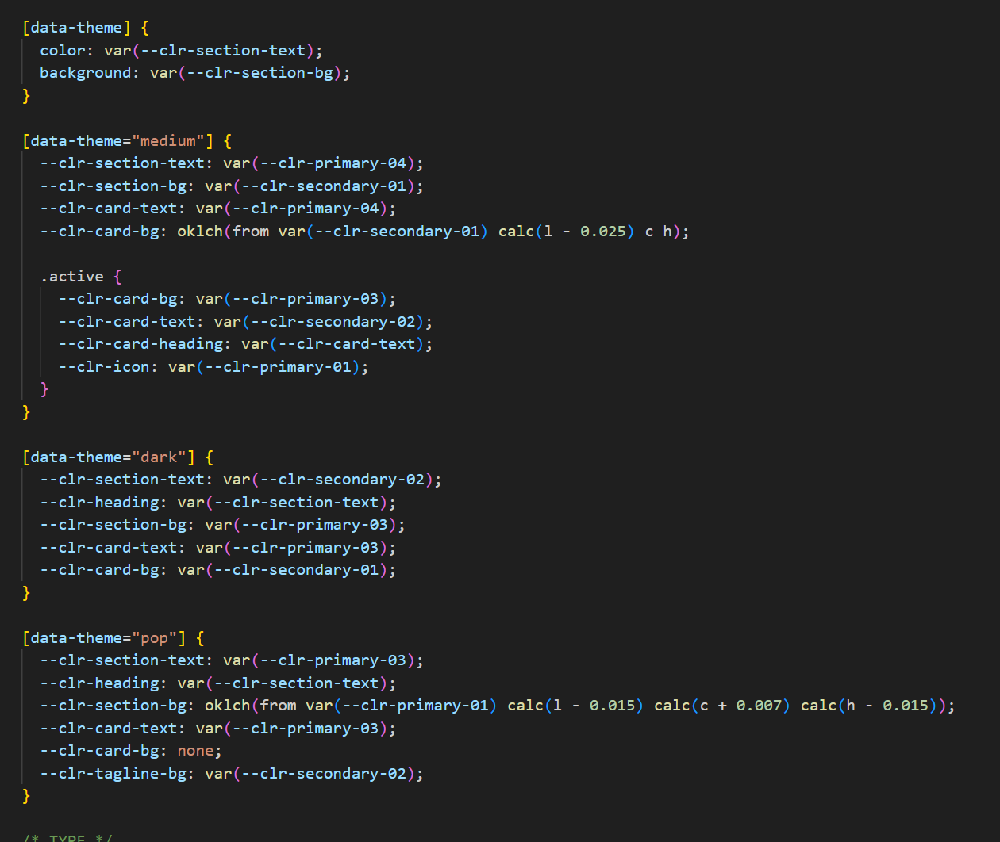
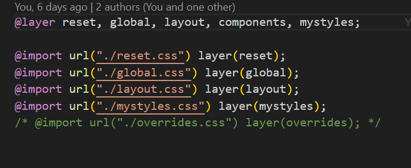
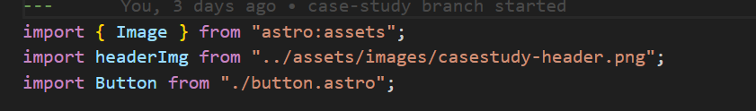
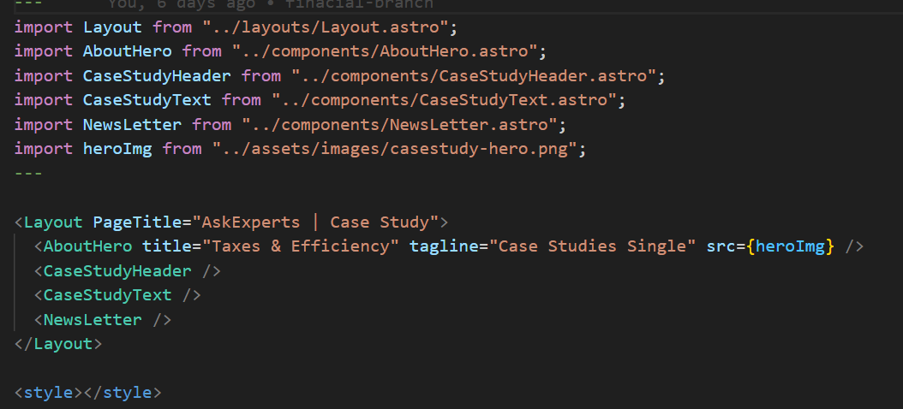
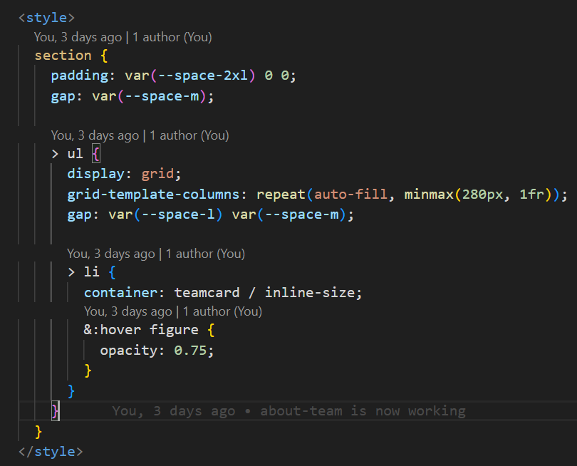
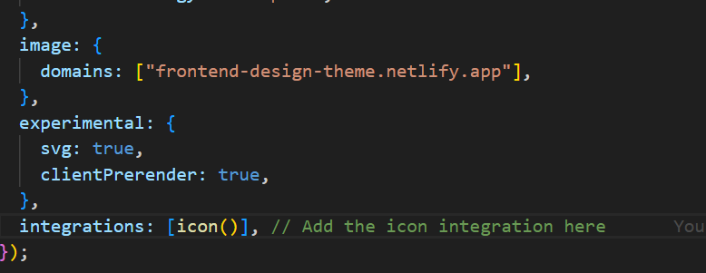
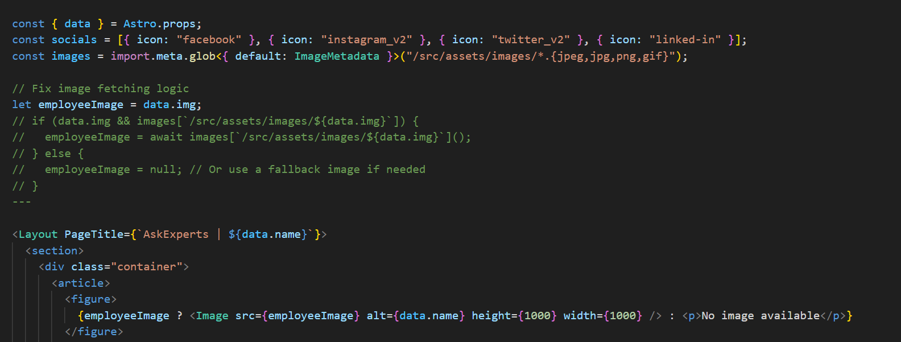
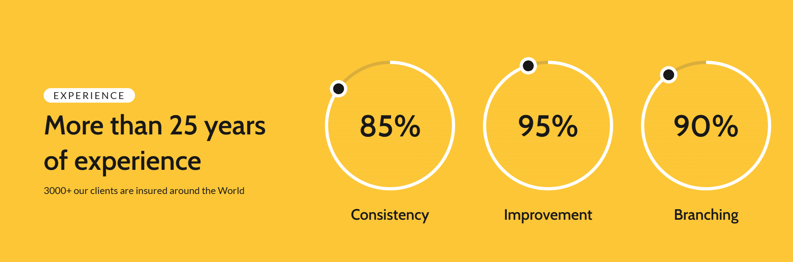
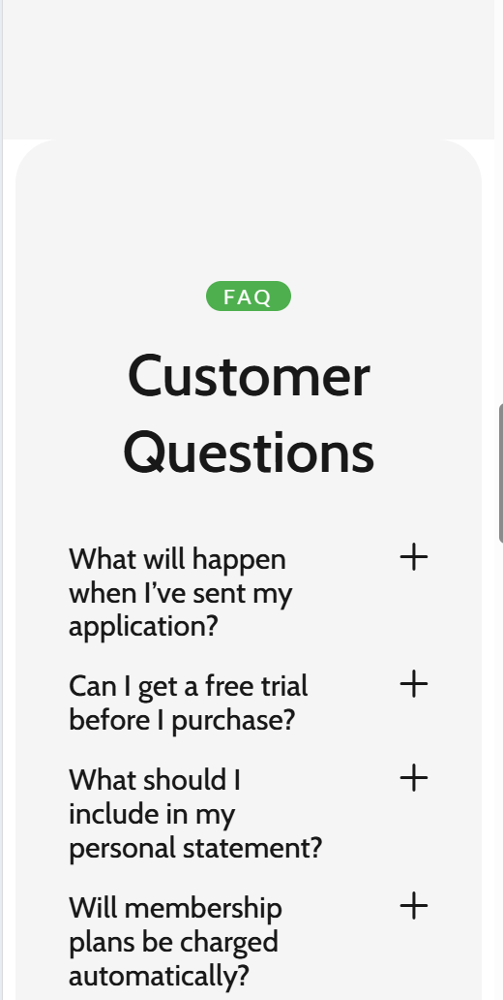

**Om Projektet**  
Dette projekt er udviklet med Astro, hvor jeg har fokuseret på at skabe en responsiv, moderne og performant weboplevelse. Jeg har anvendt de nyeste CSS-teknikker for at sikre en skalerbar og fleksibel UI.

✨ **CSS-Teknikker Bruges**  
Jeg har implementeret flere avancerede stylingmetoder i projektet:

🧩 **CSS Nesting** – For mere struktureret og overskuelig styling.  
📏 **Clamp() for Fluid Typography** – Sikrer, at typografien skalerer dynamisk afhængigt af skærmstørrelsen.  
📦 **Container Queries** – Gør komponenter mere uafhængige ved at tilpasse dem baseret på deres container frem for viewport.  
🎨 **Global CSS Variables** – Defineret i global.css for farver, corner radius og spacing, hvilket gør designet mere ensartet og lettere at vedligeholde.

**# Stylesheets:**  
I min global css har jeg lavet variabler til spacing, text-size, farver og corner radius.  

I min mystyles.css har jeg min headings, p og data-themes, som jeg har lavet [data-themes] med bestemt farvepalet, som jeg nemt kan skifte med dark, medium, pop themes.  
For at skabe sektioner med skiftende farvetemaer—hvor tekstfarve og baggrundsfarve bytter plads—har jeg anvendt data-theme-attributten. Denne attribut angiver, hvilket farvetema en sektion skal følge, og når temaet ændres, opdateres mine custom CSS properties automatisk. Dette gør det nemt at styre farveskift uden at skulle overskrive styles manuelt.  

I min layout.css har jeg min layout styles, hvor jeg har skrevet min grid med 3 kolonner, 3 rækker.  

**# Brug af Cascade layers:**  

📂 **Struktur og Sidemoduler (#Pages)**  
Jeg har opdelt projektet i flere sider (pages), hvor jeg importerer komponenter for at holde koden organiseret og genanvendelig.

**Komponent-baseret Arkitektur**  
For at forbedre readability og genbrug har jeg skabt små komponenter, som jeg importerer i større parent-komponenter. Dette gør det lettere at vedligeholde og skalere projektet.

Eksempel: Jeg har oprettet en Button.astro/card.astro eller teamcard.astro, som jeg genbruger på tværs af projektet ved at importere den i andre komponenter, hvor en knap er nødvendig.  
  
Samme tilgang er brugt til Tagline.astro og AboutHero.astro, som er importeret på flere sider (pages/team.astro, pages/about.astro og pages/casestudy.astro).  
💡 **Effektivitet:** Da disse sider har samme layout, men forskellige billeder, har jeg valgt at importere billeder direkte på hver enkelt side. På denne måde genbruger jeg koden, mens jeg varierer indholdet—hvilket både optimerer kodebasen og reducerer gentagelser.

**# Brug af Containerqueries for responsivitet:**  
I dette projekt har jeg brugt container queries for at gøre komponenterne mere fleksible og uafhængige af viewportens størrelse.

I sektionen med teamList.astro (li) har jeg defineret hvert kort som en container:  
  
  
  
Dette betyder, at styling af indholdet i kortene kan tilpasses baseret på kortets bredde i stedet for hele skærmens størrelse.

**# UDFORDRING:**

1. Jeg får nogle mærkelige errors i mine komponenter. Nogle bliver væk ved at @its check, men så får jeg en mærkelig error, hvor JavaScript-kode, som jeg har skrevet i min header for burger-menu, kommer frem på min deployed version.  
   Efter at have prøvet mange gange, gik jeg til tutor og ved at skrive bare `script{ display: none; }` i min layout css, bliver bug fixet.  
   
   

2. Den anden udfordring var at hente single-view og især billeder af hver enkelt employee, men til sidst fungerede den ved at skrive images i astro.config.mjs og noget rettelse i slug.astro, og det virker.  
   

**# HVAD MANGLER JEG:**

1. Jeg kunne ikke få animerede cirkler med tal til at fungere. Jeg har simpelthen ikke haft tid til at arbejde på det. Jeg har kigget på nogle clipart-løsninger, men har ikke haft tid til at animere dem.
   

2. Jeg mangler nogle detaljerede styles i single-view og mobilversionen. Der er plads til forbedringer i visse komponenter, som jeg ikke har haft tid til at optimere på grund af tidsmangel.
   
   
   
